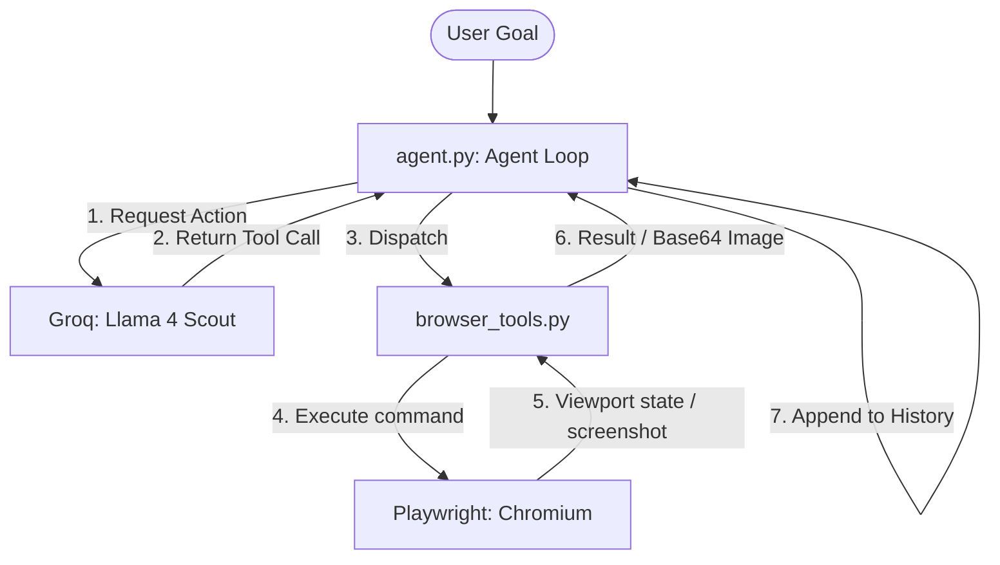

# Architecture Document — Website Automation Agent

This document details the architectural design, workflow, and engineering decisions for the AI-driven Website Automation Agent.

---

## 🏗️ System Overview

The agent is split into two modular layers to maintain a clean **separation of concerns**:

1. **Cognitive Layer (`agent.py`)**: Responsible for system prompting, keeping conversation history, interacting with the Groq LLM API, and coordinating steps. It has no knowledge of Playwright syntax or page control.
2. **Execution Layer (`browser_tools.py`)**: Implements synchronous, low-level browser automation commands using Playwright. It is stateless and acts strictly as a "driver" exposing a clean interface for the cognitive layer.

---

## 🔄 Agent Workflow (Step-by-Step)

The automation runs in an iterative loop up to `MAX_AGENT_STEPS` (default: 20):

1. **Initialization**:
   - The loop starts with a system prompt defining the agent's constraints and the specific goal requested by the user.
   - The agent calls `open_browser` and `navigate_to_url`.

2. **Perception (Vision-First)**:
   - The agent captures the browser's viewport state using `take_screenshot`.
   - The file is saved locally to `screenshots/` and converted to a **Base64-encoded PNG data URI**.
   - This base64 image is injected directly into the LLM context inside a vision block, allowing the model to "see" the page layout.

3. **Decision & Tool Calling**:
   - The LLM receives the history of actions and the current screenshot.
   - It selects a tool from `TOOLS` to interact with the page (e.g., scrolling, typing, clicking coordinates, or using a CSS selector).
   - If the task is finished, it calls `task_complete` to exit the loop.

4. **Action Execution**:
   - `agent.py` dispatches the tool call to the matching Playwright wrapper function.
   - Any execution exceptions (network timeout, element not found) are caught, serialized into a JSON error response, and sent back to the LLM to allow it to recover and try an alternative approach.

---

## 🛠️ Key Design Decisions

### 1. Vision-First + Hybrid Element Locating
* **Problem**: Pure CSS or XPath selectors are highly brittle. If a class name changes or elements dynamic load, hardcoded selectors fail.
* **Solution**: The LLM uses the page screenshot to visually locate input boxes, buttons, and links. It can interact by:
  - **Coordinates (`click_on_screen`, `double_click`)**: Clikcs on absolute pixel coordinates (e.g. `(x, y)`).
  - **CSS Selectors (`fill_by_selector`, `click_by_selector`)**: Uses standard, robust selectors if they are easily accessible in the DOM.

### 2. State Isolation
* `browser_tools.py` maintains global variables (`_playwright`, `_browser`, `_context`, `_page`) to hold the session state.
* The agent loop uses simple JSON strings and dictionary outputs, meaning the LLM itself never interacts with live Playwright objects. This ensures that the LLM code can be ported to different OS, languages, or browser engines with minimal modification.

### 3. Graceful Error Recovery
* Playwright commands that are prone to failure (like waiting for a selector) are wrapped in try-except blocks.
* Instead of crashing, the agent receives the error description in the chat history, permitting it to scroll, reload, or use alternative selectors to achieve its goal.

### 4. Safety and Loops Limits
* `MAX_AGENT_STEPS` acts as a fail-safe to prevent infinite loops and excessive API credit consumption if the agent becomes stuck on a page element.
